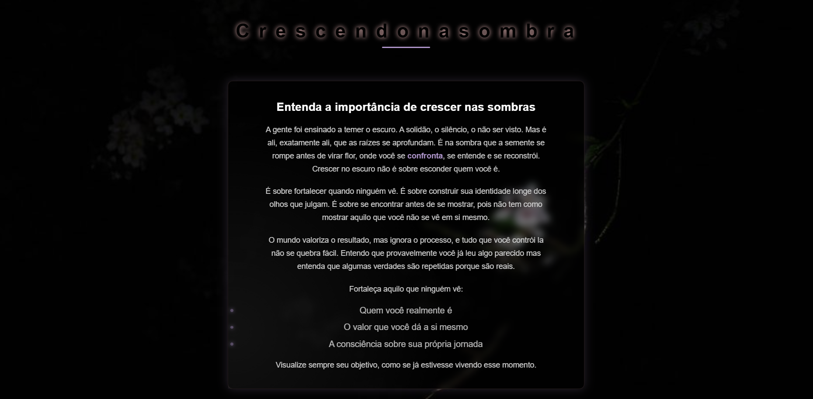

# 🌑 ShadowBloom

> Primeiro projeto pessoal desenvolvido com HTML, CSS e JavaScript.

## 📖 Sobre o Projeto

ShadowBloom nasceu da reflexão sobre crescimento pessoal, autoconhecimento e evolução silenciosa.

A proposta é transmitir a ideia de que grandes transformações acontecem longe dos holofotes, durante momentos de silêncio, aprendizado e reconstrução.

Mais do que uma página web, ShadowBloom representa o processo de crescer nas sombras antes de florescer.

---

## 🌱 Minha Jornada

Este projeto marca o início da minha jornada prática no desenvolvimento Front-End.

Foi a primeira vez que transformei uma ideia própria em uma experiência visual utilizando HTML, CSS e JavaScript, explorando não apenas a estrutura da página, mas também animações, interatividade e efeitos visuais.

---

## ✨ Funcionalidades

* Animações de entrada dos elementos
* Efeito Glassmorphism
* Efeito 3D interativo no card
* Destaques visuais com CSS
* Responsividade para dispositivos móveis
* Manipulação do DOM com JavaScript
* Efeito de iluminação dinâmica baseado no cursor

---

## 🎯 Inspiração

A mensagem central do projeto é simples:

> Algumas das transformações mais importantes da vida acontecem quando ninguém está olhando.

---

## 📸 Preview

---

## 🚀 Projeto Online

🔗 https://lauanoliveira.github.io/ShadowBloom/

---

## 🛠️ Tecnologias

* HTML5
* CSS3
* JavaScript

---

## 👨‍💻 Autor

**Lauan Oliveira**

Desenvolvedor Front-End em aprendizado contínuo.

*"Antes de florescer, toda raiz cresce na sombra."*
